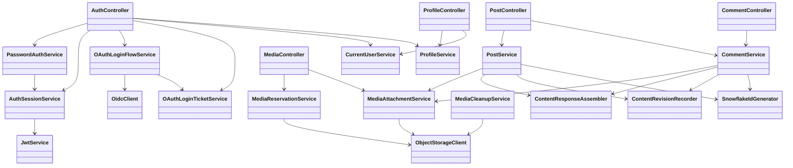
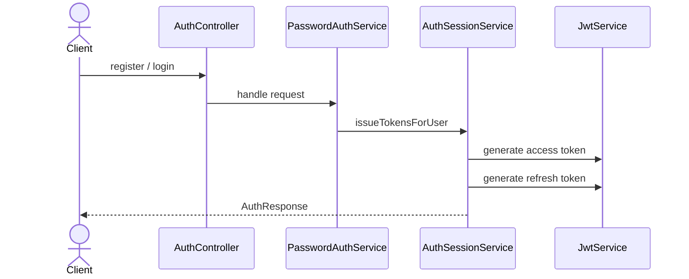
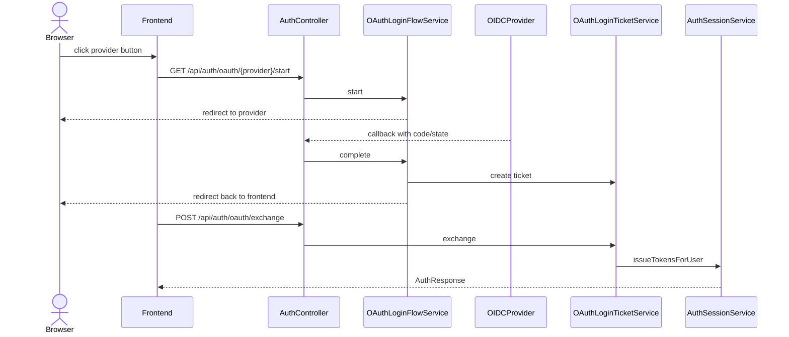
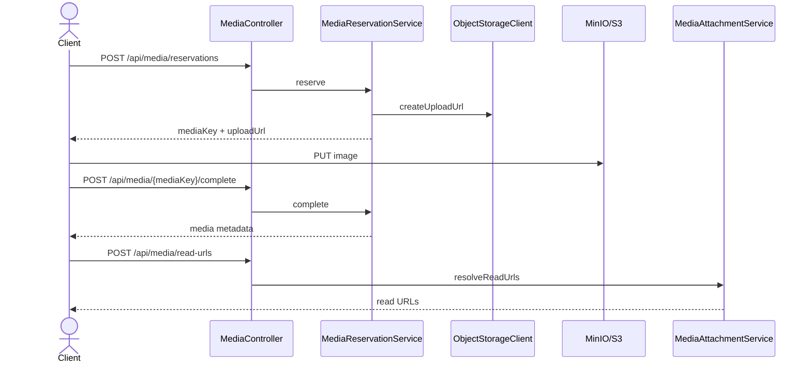
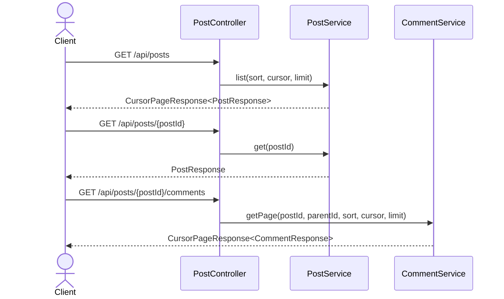
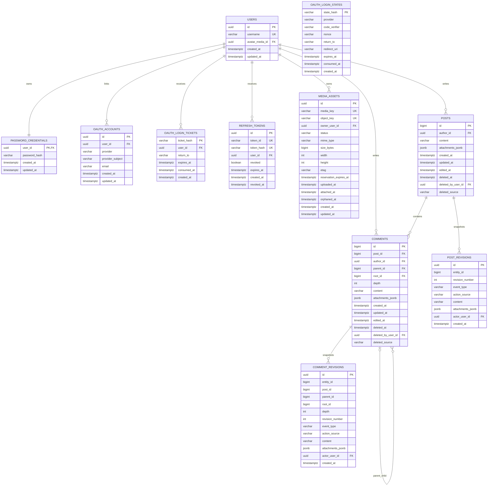

# CommunityHub Backend

CommunityHub backend là API `Spring Boot` cho ứng dụng blog/forum dạng `post + comments`.

Stack chính:
- `Java 21`
- `Spring Boot 3`
- `PostgreSQL`
- `MinIO / S3-compatible storage`
- `JWT`
- `OIDC`

## Chức năng hiện có

### Auth
- đăng ký bằng username/password
- đăng nhập bằng username/password
- refresh token
- logout
- lấy current user qua `GET /api/auth/me`
- đăng nhập OIDC qua provider local/dev:
  - `google`
  - `facebook`

### Profile
- cập nhật username
- cập nhật avatar bằng `mediaKey`

### Media
- tạo media reservation
- upload ảnh trực tiếp qua presigned URL
- complete upload
- resolve read URL ngắn hạn cho ảnh

### Posts
- tạo post
- sửa post
- xóa post
- lấy feed posts theo cursor
- lấy post detail

### Comments
- tạo comment root
- tạo reply lồng nhiều cấp
- sửa comment
- xóa comment
- lấy root comments theo cursor
- lấy replies theo cursor

### Content state
- post/comment có `attachments_jsonb`
- post/comment có `editedAt`
- post/comment hỗ trợ soft delete
- post/comment có revision history nội bộ

## API Surface

### Auth
- `POST /api/auth/register`
- `POST /api/auth/login`
- `GET /api/auth/oauth/{provider}/start`
- `GET /api/auth/oauth/{provider}/callback`
- `POST /api/auth/oauth/exchange`
- `POST /api/auth/refresh`
- `POST /api/auth/logout`
- `GET /api/auth/me`

### Profile
- `PATCH /api/profile`
- `POST /api/profile/avatar`

### Media
- `POST /api/media/reservations`
- `POST /api/media/{mediaKey}/complete`
- `POST /api/media/read-urls`

### Posts
- `POST /api/posts`
- `PATCH /api/posts/{postId}`
- `DELETE /api/posts/{postId}`
- `GET /api/posts?sort=&cursor=&limit=`
- `GET /api/posts/{postId}`
- `GET /api/posts/{postId}/comments?parentId=&sort=&cursor=&limit=`

### Comments
- `POST /api/comments`
- `PATCH /api/comments/{commentId}`
- `DELETE /api/comments/{commentId}`

## Package Map

```text
com.app.communityhub
  auth/
    api/
    password/
    session/
    oauth/
    security/
  content/
    post/
    comment/
    shared/
  media/
    api/
    reservation/
    attachment/
    cleanup/
    storage/
  user/
    profile/
  common/
  config/
```

## Class UML



## Flow UML

### Password Auth



### OAuth Login



### Media Upload



### Post + Comments Read



## Database UML



## Cấu hình `app.*`

Backend dùng `AppProperties` để gom cấu hình riêng của ứng dụng.

### `app.cors`
- `allowedOrigins`

### `app.security.jwt`
- `issuer`
- `secret`
- `accessTokenTtl`
- `refreshTokenTtl`

### `app.oauth`
- `frontendCallbackUri`
- `stateTtl`
- `ticketTtl`
- `providers.google.*`
- `providers.facebook.*`

Mỗi provider có:
- `enabled`
- `issuerUri`
- `clientId`
- `clientSecret`
- `redirectUri`

### `app.media`
- `bucket`
- `endpoint`
- `accessKey`
- `secretKey`
- `region`
- `pathStyleAccessEnabled`
- `uploadUrlTtl`
- `readUrlTtl`
- `reservationTtl`
- `orphanRetention`
- `maxFileSizeBytes`
- `allowedMimeTypes`

### `app.content.posts`
- `maxAttachments`
- `defaultPageSize`
- `maxPageSize`

### `app.content.comments`
- `maxAttachments`
- `defaultPageSize`
- `maxPageSize`

### `app.ids`
- `workerId`

## Cursor Pagination

### Feed
- route: `GET /api/posts`
- sort hỗ trợ:
  - `newest`
  - `oldest`
- response:

```json
{
  "items": [],
  "nextCursor": "opaque-or-null",
  "hasMore": true,
  "sort": "newest"
}
```

### Comments
- route: `GET /api/posts/{postId}/comments`
- root comments nhận:
  - `sort`
  - `cursor`
  - `limit`
- replies nhận:
  - `parentId`
  - `cursor`
  - `limit`

### Cursor token
- cursor là opaque token
- payload logic bám theo:
  - `id`
  - `sort`
  - `parentId`

### Sort behavior
- posts:
  - `newest`
  - `oldest`
- root comments:
  - `newest`
  - `oldest`
- replies:
  - trả theo nhánh reply của `parentId`


## Testing

```bash
./gradlew test
```
